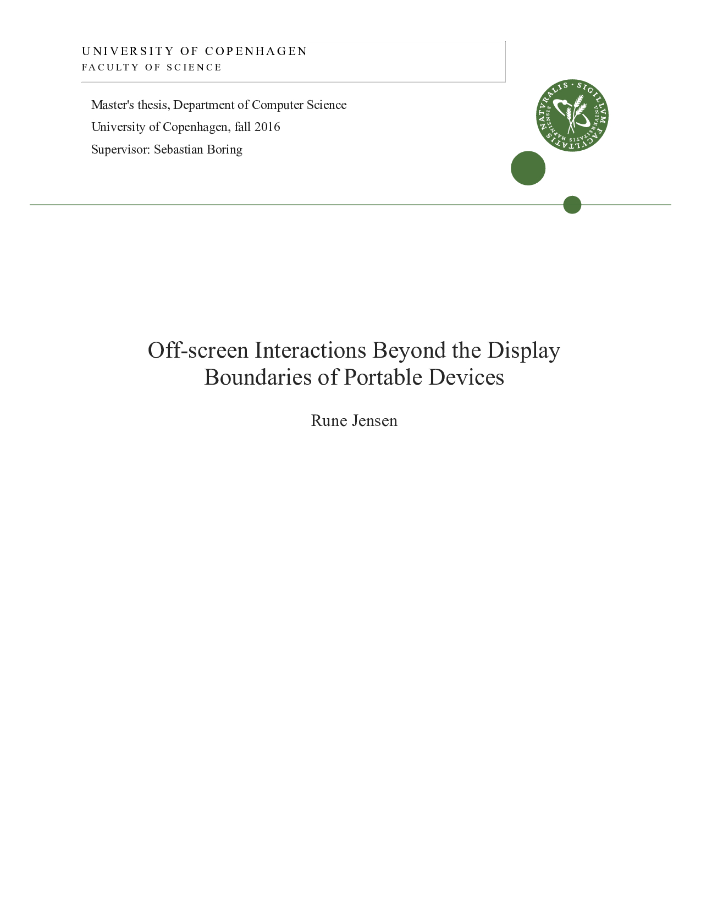
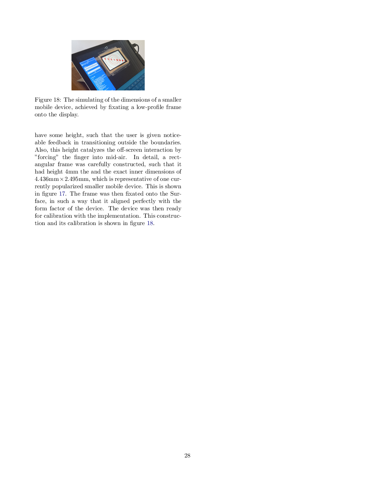
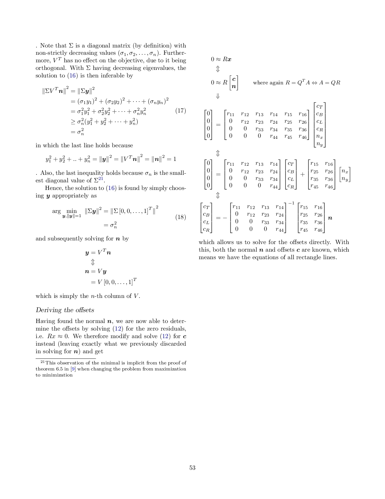
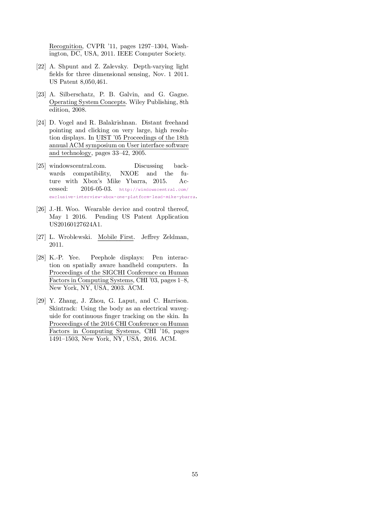

A thesis project based on using a Kinect motion-tracker to investigate off-screen interactions beyond the display boundaries of portable devices. See the [PDF version](tex/thesis.pdf) or, for the web-version, wait for this page to load.

